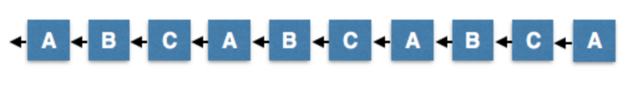
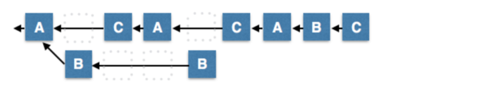
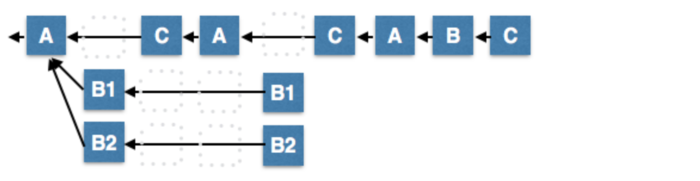
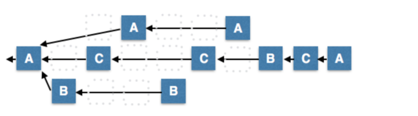
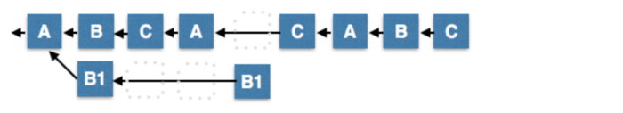
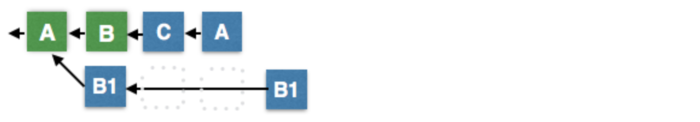
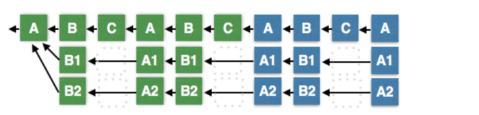

## DPOS Consensus Algorithm - The Missing White Paper

link to the original text: [https://steemit.com/dpos/@dantheman/dpos-consensus-algorithm-this-missing-white-paper](https://steemit.com/dpos/@dantheman/dpos-consensus-algorithm-this-missing-white-paper)

This is the missing white paper and analysis of delegated proof of stake (DPOS). The goal of this paper is to provide an analysis of why DPOS works and what makes it robust. An early description of DPOS can be found at [bitshares.org](https://bitshares.org/technology/delegated-proof-of-stake-consensus/); however, that description also includes many aspects that are not part of the actual consensus process.

All blockchains are fundamentally a deterministic state machine acted upon by transactions. Consensus is the process of agreeing on a deterministic order of transactions and filtering invalid transactions. There are many different consensus algorithms that could produce equivalent ordering of transactions, but DPOS has proven robust, secure, and efficient by years of reliable operation on multiple blockchains.

Like all consensus algorithms, the most harm the block producers can cause is censorship. All blocks must be valid according to the deterministic open source state machine logic.

#### Summary of DPOS Algorithm
The DPOS algorithm is divided into two parts: electing a group of block producers and scheduling production. The election process makes sure that stakeholders are ultimately in control because stakeholders lose the most when the network does not operate smoothly. How people are elected has little impact on how consensus is achieved on a minute by minute basis. Therefore, this document will focus on how consensus is reached after the block producers have been chosen.

To help explain this algorithm I want to assume 3 block producers, A, B, and C. Because consensus requires 2⁄3 + 1 to resolve all cases, this simplified model will assume that producer C is deemed the tie breaker. In the real world there would be 21 or more block producers. Like proof of work, the general rule is that longest chain wins. Any time an honest peer sees a valid strictly longer chain it will switch from its current fork to the longer one.

I will to show by example how DPOS operates under most conceivable network conditions. These examples should help you understand why DPOS is robust and hard to break.

#### Normal Operation
Under normal operation block producers take turns producing a block every 3 seconds. Assuming no one misses their turn then this will produce the longest possible chain. It is invalid for a block producer to produce a block at any other time slot than the one they are scheduled for.

#### Minority Fork
Up to 1⁄3 of the nodes can be malicious or malfunction and create a minority fork. In this case the minority fork will only produce one block every 9 seconds while the majority fork will produce 2 blocks every 9 seconds. Once again, the honest 2⁄3 majority will always be longer than the minority.

#### Double Production by Disconnected Minority
The minority can attempt to produce an unlimited number of forks, but all of their forks will be shorter than the majority chain because the minority is limited to growing the chain slower than the majority.

#### Network Fragmentation
It is entirely possible for the network to fragment in which case no fork has a majority of the block producers. In this case the longest chain will fall to the largest minority. When network connectivity is restored the smaller minorities will naturally switch to the longest chain and unambiguous consensus will be restored.

It is possible for there to be 3 forks where the two longest forks are the same length. In this case the producers on the 3rd (smaller fork) will break the tie when they rejoin the network. There is an odd number of producers so it is impossible to maintain a tie for long. Later we will cover producer shuffling which will randomize order of production to ensure that even if two forks have the same number of producers, the forks will grow in different length bursts causing one fork to take over the other.

#### Double Production by Connected Minority
Under this scenario minority B produced two or more alternative blocks on their time slot. The next scheduled producer ( C ), may choose to build off of any one of the alternatives produced by B. When this happens it will become the longest chain and all nodes that selected B1 will switch forks. It does not matter how many alternative blocks a minority of bad producers attempt to propagate, they will never be part of the longest chain for more than a round.

#### Last Irreversible Block
In the event of network fragmentation it is possible for multiple forks to continue to grow for a prolonged period of time. In the long-run, the longest chain will win, but observers require a means to know with certainty when a block is absolutely part of the fastest growing chain. This can be determined by seeing confirmation by 2⁄3+1 of the block producers.

In the diagram below, block B has been confirmed by C and A which represents 2⁄3+1 confirmation and therefore we can infer that no other chains could possibly be longer if 2⁄3 of our producers are honest.

Note that this “rule” is similar to the 6-block confirmation “rule” for Bitcoin. Some smart individuals can contrive a sequence of events where two nodes could end up on different last irreversible blocks. This edge case requires an attacker to have total control of communication delay and to utilize that control not once, but twice, minutes apart. If this were to happen, then the long-term rule of longest chain still applies. We estimate the odds of such an attack to be close enough to 0 and the economic consequences to be so insignificant that it isn’t worth worrying about.

#### Lack of Quorum of Producers
In the unlikely event that there is no clear quorum of producers, it is possible for the minority to continue producing blocks. In these blocks stakeholders can include transactions that change their votes. These votes can then select a new set of producers and restore block production participation to 100%. Once this happens the minority chain will eventually overtake all other chains operating with less than 100% participation.

During this process all observers will have knowledge that the network state is in flux until a chain emerges with 67% participation. Those who choose to transact under these conditions take risks similar to those who choose to accept less than 6 confirmations. They do so with the knowledge that there is some small probability that consensus may ultimately settle on a different fork. In practice this situation is far safer than accepting blocks with less than 3 Bitcoin confirmations.

#### Corruption of Majority of Producers
If the majority of producers become corrupt then they can produce an unlimited number of forks, each of which will appear to be advancing with 2⁄3 majority confirmation. In this case the last irreversible block algorithm reverts to longest chain algorithm. The longest chain will be the one approved by the largest-majority which will be decided by the minority of remaining honest nodes. This kind of behavior would not last long because the stakeholders would eventually vote to replace these producers.

#### Transactions as Proof of Stake (TaPoS)
When users sign a transaction they do so under a certain assumption about the state of the blockchain. This assumption is based upon their perception of recent blocks. If the consensus on the longest chain changes then it could potentially invalidate the assumptions the signer had when they consented to the transaction.

With TaPoS all transactions include a hash of a recent block and are considered invalid if that block does not exist in the chain history. Anyone who signs a transaction while on an orphaned fork will find the transaction invalid and unable to migrate to the main fork.

A side effect of this process is security against long-range attacks that attempt to generate alternative chains. Individual stakeholders directly confirm the blockchain every time they transact. Over time all blocks are confirmed by all stakeholders and this is something that cannot be replicated in a forged chain.

#### Deterministic Producer Shuffling
In all of the examples we showed a round-robin scheduling of block producers. In reality set of block producers is shuffled every N blocks where N is the number of producers. This randomization ensures that block producer B doesn’t always ignore block producer A and that anytime there are multiple forks of identical producer counts that ties are eventually broken.

#### Conclusion
Delegated Proof of Stake is robust under every conceivable natural network disruption and even secure in the face of corruption of a large minority of producers. Unlike some competing algorithms, DPOS can continue to function when a majority of producers fail. During this process the community can vote to replace the failed producers until it can resume 100% participation. I know of no other consensus algorithm that is robust under such a high and varied failure conditions.

Ultimately DPOS gains significant security from the algorithms chosen to select the block producers and verify that the nodes are of high quality and unique individuals. Using the process of approval voting ensures that even someone with 50% of the active voting power is unable to select even a single producer on their own. DPOS is designed to optimize performance of the nominal condition of 100% participation of honest nodes with robust network connections. This gives DPOS the power to confirm transactions with 99.9% certainty in an average of just 1.5 seconds while degrading in a graceful, detectable manner that is trivial to recover from.

Other consensus algorithms design for a nominal condition of dishonest nodes with poor network conditions. The end result of alternative designs is networks that have slower performance, higher latency, high communication overhead, and completely halt in the event 33% of nodes fail.

With 3 years of successful operation on BitShares and a year of Steem we have experienced all manner of network conditions and software bugs. DPOS has successfully navigated this environment and demonstrated its ability to maintained consensus while processing more transactions than any other blockchain.